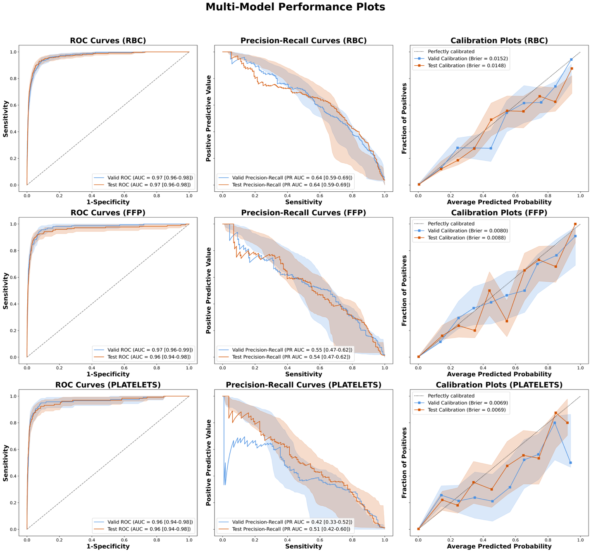
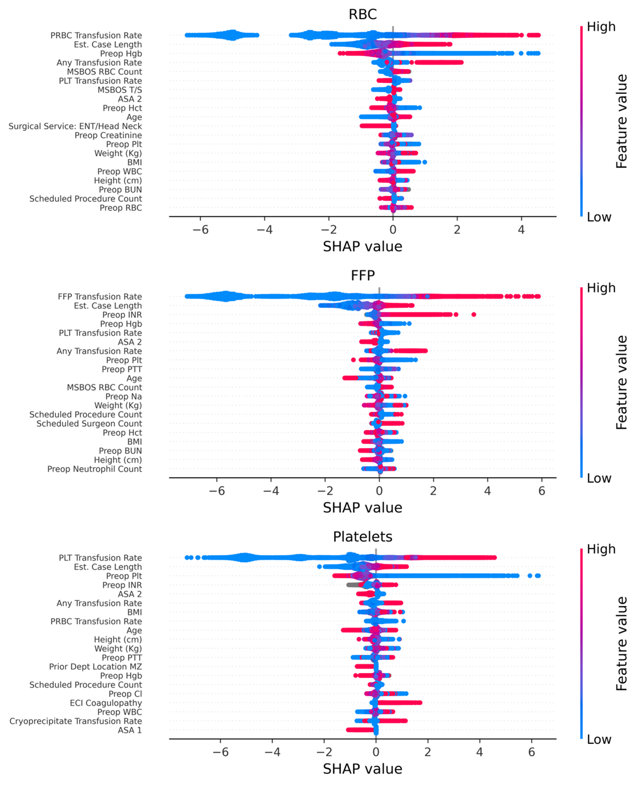
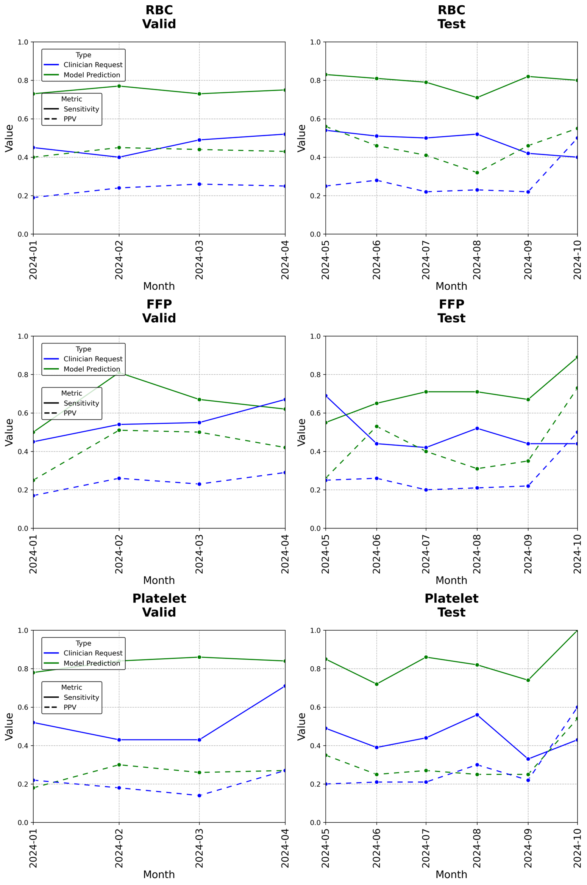
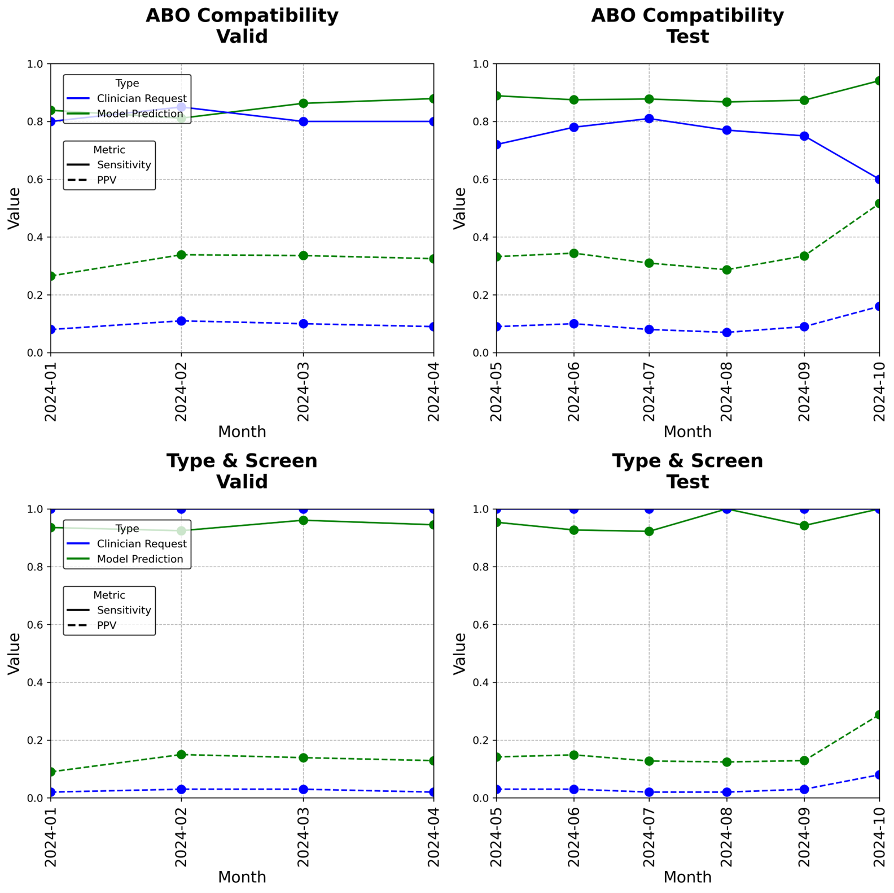

# UCSF Surgical Blood Product Recommendation System

## Overview

Leveraging machine learning to provide real-time recommendations for blood product and blood tests ordering in non-emergency surgeries at University of California, San Francisco (UCSF), reducing waste and operational costs.

This system aims to **optimize blood inventory management and enhance patient safety** by predicting the likelihood of transfusion needs for Red Blood Cells (RBC), Fresh Frozen Plasma (FFP), and Platelets *before* a procedure begins. It also predicts the need for scheduling ABO compatibility tests and Type & Screen tests for those patients. 

## Key Features
- *Multi-Class Prediction*: Generates probabilities for the need of RBC, FFP, and Platelet transfusions.

- *Actionable Recommendations*: Translates model outputs into clear, actionable recommendations for clinicians before they schedule tests or order blood products.

- *Cost Reduction*: Aims to mitigate waste of precious blood products and associated operational costs and burden to patients.

## Model Performance & Visualization

**Visual 1:** A figure showcasing the ROC/PR curve of the multi-class model, highlighting sensitivity/specificity.

**Visual 2:** A visualization of Feature Importance (e.g., Shapley Values), highlighting the most predictive clinical features.

**Visual 3:** Comparing monthly average sensitivity and PPV of blood products ordering between model predictions and historical clinician requests

**Visual 4:** Comparing monthly average sensitivity and PPV of ABO compatibility tests and Type & Screen tests scheduling between model predictions and historical clinician requests

## Core ML Pipeline & Training

These scripts define the data preparation and final model generation process.

| Script Name | Purpose |
| :--- | :--- |
| `build_hipac_model_multi.py` | Core script for splitting data, feature transformation (by 'hipac_modeling_tools.py'), training the final multi-class **XGBoost model**, and saving all assets (model, transformer, thresholds). |
| `hipac_modeling_tools.py` | Prepares clinicial data for machine learning by calculating comorbidity indices (CCI & ECI) and and deriving historical blood transfusion rates associated with specific procedure codes (PICIS). It also standardizes continuous features and one-hot encodes categorical features for the entire dataset. |
| `get_recomm.py` | Generates the statistics tables and Visual 4, including model performance metrics (sensitivity, PPV, thresholds), and creates multi-classification labels for downstream use. |

## Data Exploration & Model Validation

Scripts used for generating visualizations, performance metrics, and in-depth data exploration.

| Script Name | Output/Visualization | Purpose |
| :--- | :--- | :--- |
| `performance_curves.py` | ROC, Precision-Recall, Calibration plots (Visual 1) | Calculates metrics (sensitivity, PPV, NPV) with de Long CIs, and plots performance curves. |
| `feature_ranking.py` | Shapley value plots (Visual 2) | Creates the figure that visualizes feature importance ranking. |
| `table1_wei.py` | Summary Statistics Table | Generates Table 1 in the paper (summary statistics for group comparisons across selected features). |
| `multiclass_model_2025_output_analysis.py` | Combined Feature/Output | Creates a comprehensive dataframe for deep model output analysis. |
| `order_request_cleanup_all_blood_products.ipynb` | Processed data files | Extracts and  transforms cleaned & complete UCSF EHR datasets to generate time-series datasets for statistical analysis and visualization. |
|`timetrend_visualization_valid_test.ipynb` | Monthly Model VS Clinicians Comparison (Visual 3) | Loads processed data files & automates visualization of time-series datasets. |

## Utilities & Dependencies

| Component | Description |
| :--- | :--- |
| `MSBOS_06_Analysis_Tools.py` | Modular functions for calculating performance metrics and generating standard curves. |
| `environment.yml` | **Prerequisites:** Used with `conda env create` to set up the necessary Python environment and packages. |

## Getting Started

To run the project locally:

1.  **Clone:** `git clone [your_repo_link]`
2.  **Setup Environment:** `conda env create -f environment.yml`
3.  **Activate:** `conda activate [your_env_name]`
4.  **Run Pipeline:** Execute `python build_hipac_model_multi.py` to train the model and save assets.

**Note:** No data uploaded to Github due to University Compliance.

## Contributors

* **Weisong Zhang** (Role: Multi-Classification Model Developer, Data Analyzer)
* **Priya Ramaswamy** (Role: Mentor)
* **Other student/co-worker of Dr. Ramaswamy** (Role: Developed the old model for RBC transfusion prediction)
